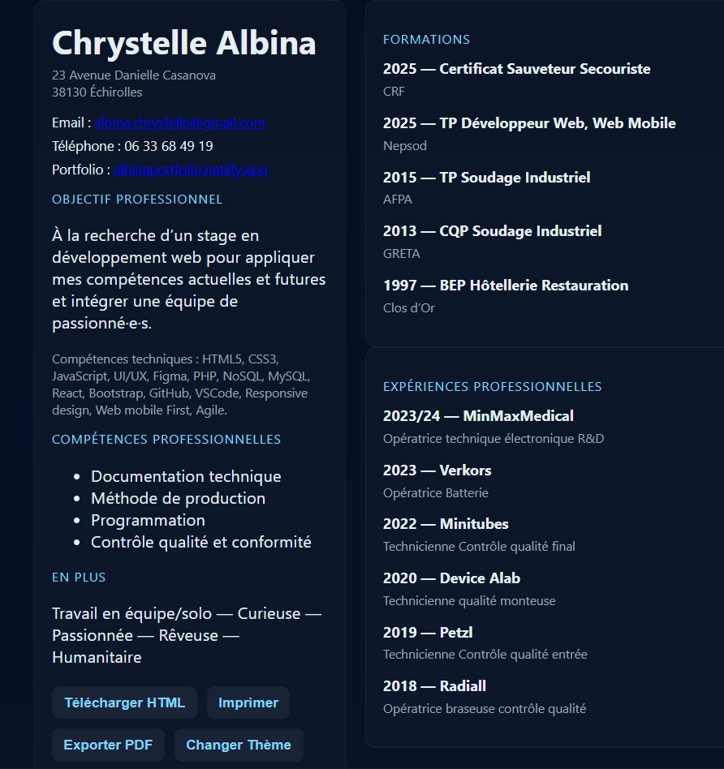

# CV de Chrystelle Albina

Ce projet contient une version **interactive en HTML/CSS/JS** du CV de Chrystelle Albina, développeuse web et web mobile.

## Capture d’écran

## Fonctionnalités

* **Responsive Design** : s’adapte aux écrans desktop et mobile.
* **Thèmes clair/sombre** : bascule via un bouton.
* **Téléchargement HTML** : sauvegarde du CV complet en fichier `.html`.
* **Impression** : bouton pour imprimer directement.
* **Export PDF** : génération automatique d’un PDF à partir de la page grâce à `html2canvas` et `jsPDF`.
* **Sections interactives** : expériences professionnelles et formations sont repliables au clic.

## Technologies utilisées

* **HTML5** pour la structure
* **CSS3** (flexbox, grid, variables CSS) pour la mise en page et les thèmes
* **JavaScript (ES6)** pour les interactions
* **html2canvas** et **jsPDF** pour l’export PDF

## Utilisation

1. Cloner ou télécharger le projet.
2. Ouvrir le fichier `cv_chrystelle_albina.html` dans un navigateur moderne.
3. Utiliser les boutons :

   * `Télécharger HTML` → enregistre une copie du CV.
   * `Imprimer` → ouvre la boîte de dialogue d’impression.
   * `Exporter PDF` → génère un fichier PDF.
   * `Changer Thème` → alterne entre clair et sombre.

## Auteur

**Chrystelle Albina**
Développeuse Web & Web Mobile
📧 [albina.chrystelle@gmail.com](mailto:albina.chrystelle@gmail.com)
🌍 [Portfolio](https://albinaportfolio.netlify.app)
